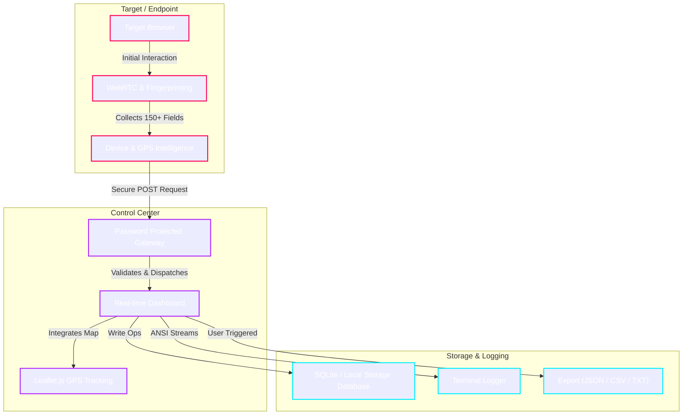

<!--
  PREMIUM GITHUB PROFILE README
  Owner: 0xK3rnelX
  Aesthetic: Black Terminal / Neon Red, Purple, Cyan Accents
  File: README.md
-->

<div align="center">

<!-- Typing SVG Header -->


<p align="center">
  <samp>
    <a href="#about">About</a> •
    <a href="#skills">Skills</a> •
    <a href="#featured-project">Featured Project</a> •
    <a href="#github-stats">Stats</a> •
    <a href="#development-environment">Environment</a> •
    <a href="#contact">Contact</a>
  </samp>
</p>

---

</div>

<a id="about"></a>
## 📂 About Me

```
[System Status: Active]
[Role: Cybersecurity Researcher & Python Developer]
```

I am a cybersecurity researcher focused on offensive security, automation, Python development, reconnaissance, threat intelligence, and security tooling. I enjoy building professional security frameworks, scanners, automation utilities, and penetration testing tools that help teams identify exposures, analyze threats, and simulate realistic attack paths.

My workflow centers around designing high-efficiency, multi-threaded tools that collect structured intelligence, perform complex device fingerprinting, and provide clean visualization dashboards.

---

<a id="skills"></a>
## 🛠️ Technical Capabilities

<div align="left">

| Domain | Tech Stack & Capabilities |
| :--- | :--- |
| **Languages** |     |
| **Infrastructure & Tools** |   |
| **Specializations** |   |

</div>

---

<a id="featured-project"></a>
## 🚀 Featured Project

<div align="center">

### `droff`
**A Professional C2 Intelligence Framework for Authorized Security Research & Red Team Simulation**

[](https://github.com/0xK3rnelX/droff)
[](https://github.com/0xK3rnelX/droff/blob/main/LICENSE)
[](https://github.com/0xK3rnelX/droff)

</div>

#### 📝 Project Overview
`droff` is a premium command-and-control (C2) reconnaissance and intelligence-gathering framework. Built primarily to facilitate authorized adversary simulation exercises, it gathers deep system and network telemetry to evaluate defensive posturing and corporate vulnerability to client-side threat vectors.

#### 🏗️ Architecture Flow (Mermaid)



#### 🛡️ Framework Features

<table>
  <thead>
    <tr>
      <th width="30%">Feature Category</th>
      <th width="70%">Capability Description</th>
    </tr>
  </thead>
  <tbody>
    <tr>
      <td><strong>Campaign Front-end</strong></td>
      <td>Convincing, high-fidelity phishing page templates designed to safely capture behavioral intelligence during social engineering assessments.</td>
    </tr>
    <tr>
      <td><strong>Real-Time C2 Dashboard</strong></td>
      <td>A responsive, modern control center interface secured behind a robust credentials gateway to monitor incoming agent telemetry in real time.</td>
    </tr>
    <tr>
      <td><strong>Geolocation Engine</strong></td>
      <td>Live interactive GPS map tracking utilizing Leaflet.js to pinpoint endpoint locations based on hardware and browser sensor details.</td>
    </tr>
    <tr>
      <td><strong>Deep Fingerprinting</strong></td>
      <td>Gathers over 150+ structured intelligence data points, extracting detailed WebRTC configs, local network adapters, and precise device profiles.</td>
    </tr>
    <tr>
      <td><strong>Data Administration</strong></td>
      <td>Supports ad-hoc victim tagging, persistent notes, global real-time record searching, and comprehensive export capabilities in CSV, JSON, or TXT format.</td>
    </tr>
    <tr>
      <td><strong>Diagnostic Logging</strong></td>
      <td>Rich ANSI-colored terminal stdout/stderr streaming for detailed audit trails and debugging.</td>
    </tr>
  </tbody>
</table>

#### ⚙️ Deployment & Execution

```bash
# Clone the repository
git clone https://github.com/0xK3rnelX/droff.git

# Navigate into project root
cd droff

# Install required framework dependencies
pip install -r requirements.txt

# Start the C2 intelligence dashboard
python main.py
```

<div align="center">
  <br />
  <samp>
    <a href="https://github.com/0xK3rnelX/droff">🚀 Repository</a> • 
    <a href="https://github.com/0xK3rnelX/droff#readme">📖 Documentation</a> • 
    <a href="https://github.com/0xK3rnelX/droff/issues">🐛 Report Issues</a>
  </samp>
  <br />
</div>

---

<a id="github-stats"></a>
## 📊 GitHub Analytics

Here are my development stats, configured with the terminal-neon dark style:

<div align="center">

| | |
| :---: | :---: |
|  |  |
|  |  |

<br />


</div>

---

<a id="development-environment"></a>
## 💻 Development Environment

```bash
$ neofetch --source /profile/0xK3rnelX
```

```ansi
 [1;31m0xK3rnelX [0m@ [1;35mterminal-core [0m
--------------------------
 [1;36mOS [0m: Windows 11 / Linux (Dual Boot / WSL2)
 [1;36mEditor [0m: VS Code / Neovim
 [1;36mLanguages [0m: Python (Primary), JavaScript, HTML5, CSS3
 [1;36mTools [0m: Git, Docker, Postman, Wireshark, Burp Suite
 [1;36mTerminal [0m: Windows Terminal / Alacritty
 [1;36mShell [0m: PowerShell / Zsh
 [1;36mStatus [0m: Active Daily (Building & Testing Security Tools)
```

---

<a id="contact"></a>
## ✉️ Secure Communications

For collaboration, inquiries, or bug disclosures, reach out via the secure routes below:

- **Secure Email:** `trexBlde@proton.me`
- **GitHub:** [@0xK3rnelX](https://github.com/0xK3rnelX)
- **Portfolio:** [0xk3rnelx.github.io](https://github.com/0xk3rnelx/0xk3rnelx.github.io)

---

<div align="center">

```
+------------------------------------+
|  Building security tools.          |
|  Automating workflows.             |
|  Learning every day.               |
+------------------------------------+
```

<sub>*Designed with neon accents for modern dark-themed GitHub interfaces.*</sub>

</div>
