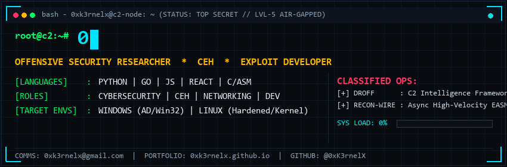

  

### ⚡ OFFENSIVE SECURITY RESEARCHER &bull; CEH &bull; EXPLOIT DEVELOPER ⚡

  <em>"Code is architecture until it executes; then it becomes capability."</em>

---

## 🛰️ // OPERATOR DOSSIER

I am **0XK3RNELX**, an offensive security practitioner, Certified Ethical Hacker (**CEH**), and exploit tooling engineer. I specialize in building weaponized adversary emulation architectures, asynchronous attack surface reconnaissance platforms, and resilient Command-and-Control (C2) pipelines engineered to operate under high-scrutiny enterprise telemetry.

- **Primary Focus**: Weaponized C2 infrastructure, EDR evasion mechanics, distributed offensive automation.
- **Operating Enclaves**: Windows internals (Win32 API, Active Directory) & Hardened Linux kernels.
- **Protocols & Egress**: Covert DNS tunneling, mTLS listeners, HTTP/2 multiplexing, raw socket crafting.
- **Core Arsenal**: Python (AsyncIO), Go, JavaScript, React, HTML5, CSS3.

---

## 🛠️ // TACTICAL ARSENAL & TELEMETRY

| Domain | Weaponry & Stack (Tactical Arsenal) |
| :--- | :--- |
| **Offensive Tooling & Core Languages** |   )  |
| **Tactical Frontends & Dashboards** |     |
| **Exploitation & Operations** |    |
| **Distributed Networks & C2** |    |
| **Operating Environments** |     |

 

### ⚡ LANGUAGE & TOOLING TELEMETRY ⚡

  

---

## 🗄️ // FEATURED OPERATIONS & REPOSITORIES

### 1. [DROFF] &mdash; Professional C2 Intelligence Framework
> **Status:** `RESTRICTED RESEARCH // PRIVATE REPOSITORY`  
> **Target:** Host Orchestration & Covert Staging

- Modular data collection, geolocation, and visualization platform for security research.
- Engineered for distributed multi-node agent staging and asynchronous beacon ingestion.
- Built-in traffic shaping, modular encrypted fallback listeners, and evasive sleep-masking algorithms.

---

### 2. [RECON-WIRE](https://github.com/0xK3rnelX/RECON-WIRE) &mdash; High-Velocity EASM Framework
> **Status:** `TACTICAL OPEN SOURCE`  
> **Target:** External Attack Surface Management & Target Interrogation

- Asynchronous, concurrent network reconnaissance pipeline optimized for Red Teams, Penetration Testers, and Bug Bounty Operators.
- Capable of saturating multi-gigabit connections for mass host discovery, port fingerprinting, and subdomain enumeration with zero packet loss.
- Hybrid architecture utilizing **Go** for high-throughput packet generation and **Async Python** for threat modeling heuristics.

---

## 📡 // SECURE TRANSMISSION CHANNELS

